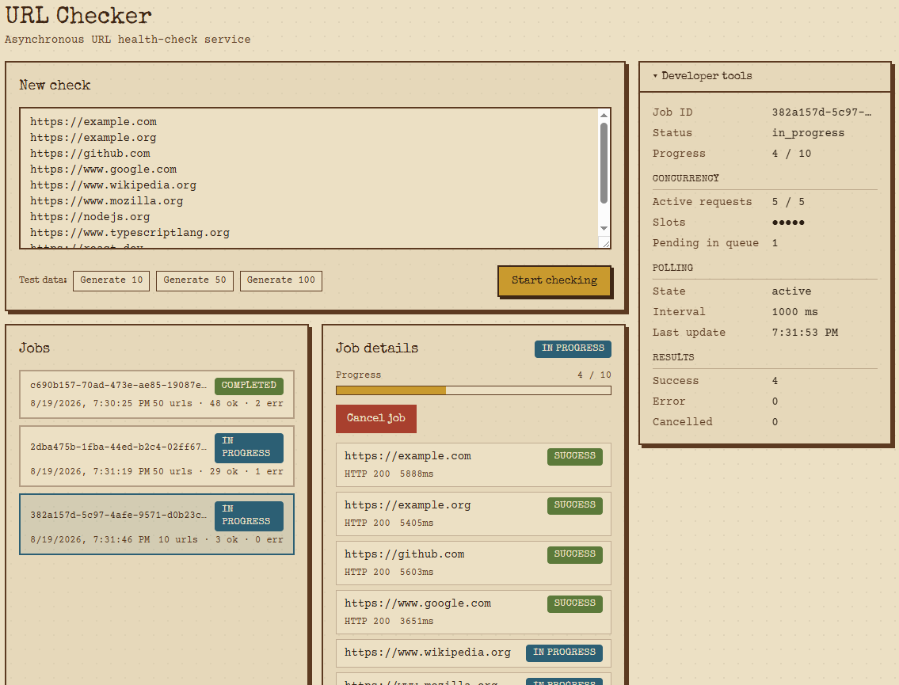
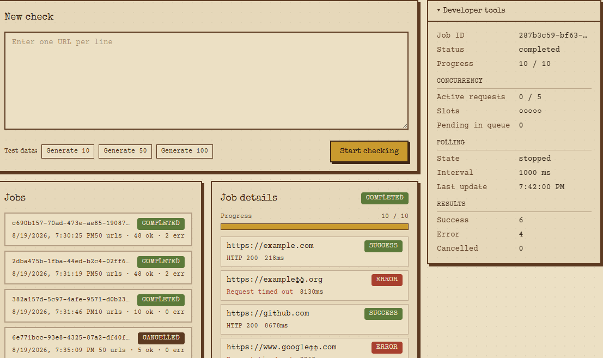
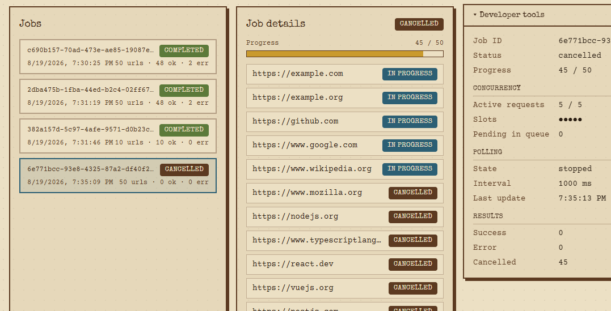

# URL Checker

Асинхронный сервис проверки списка URL: бэкенд создаёт задание и асинхронно
проверяет каждый URL через HTTP `HEAD` (не более 5 одновременных запросов
на задание), отдавая прогресс и результаты по API; фронтенд запускает
задания, следит за прогрессом и умеет их отменять.

## Стек

- **Backend**: Node.js, TypeScript, NestJS, in-memory хранилище (без БД)
- **Frontend**: React 19, TypeScript, Vite, Zustand, Tailwind CSS

## Структура репозитория

```
backend/    REST API (NestJS)
frontend/   SPA (React + Vite)
```

## Запуск

Требуется Node.js 20+.

### Backend

```bash
cd backend
yarn install
yarn start:dev
```

Поднимется на `http://localhost:3000`, все роуты — под префиксом `/api`.

Переменные окружения (опционально, есть значения по умолчанию):

| Переменная    | По умолчанию            | Назначение                        |
| ------------- | ------------------------ | ---------------------------------- |
| `PORT`        | `3000`                   | порт HTTP-сервера                  |
| `CORS_ORIGIN` | `http://localhost:5173`  | origin, разрешённый для CORS       |

### Frontend

```bash
cd frontend
yarn install
yarn dev
```

Поднимется на `http://localhost:5173`.

Переменные окружения (опционально):

| Переменная      | По умолчанию                  | Назначение          |
| ---------------- | ------------------------------ | -------------------- |
| `VITE_API_URL`   | `http://localhost:3000/api`   | адрес backend API    |

Оба сервиса нужно запускать одновременно (в двух терминалах).

### Docker

```bash
docker compose up --build
```

Поднимет backend на `http://localhost:3000` и frontend (собранный статический
билд за nginx) на `http://localhost:5173`. Порты и `CORS_ORIGIN`/`VITE_API_URL`
настроены в [docker-compose.yml](docker-compose.yml).

## API

| Метод    | Путь             | Описание                                                   |
| -------- | ---------------- | ------------------------------------------------------------ |
| `POST`   | `/api/jobs`      | создать задание: `{ "urls": ["https://..."] }` → `{ "jobId" }` |
| `GET`    | `/api/jobs`      | список заданий с краткой статистикой                        |
| `GET`    | `/api/jobs/:id`  | детали задания: статус каждого URL, HTTP-код, ошибка, длительность |
| `DELETE` | `/api/jobs/:id`  | отменить задание (необработанные URL помечаются `cancelled`) |

Статусы задания: `pending`, `in_progress`, `completed`, `cancelled`, `failed`.
Статусы отдельного URL: `pending`, `in_progress`, `success`, `error`, `cancelled`.

Логика проверки URL: HTTP `HEAD`-запрос с таймаутом 8с, затем искусственная
случайная задержка 0–10с перед сохранением результата, не более 5
одновременных запросов на одно задание; несколько заданий обрабатываются
параллельно.

## Фронтенд

- Форма создания задания (textarea, по одному URL на строку)
- Список заданий с возможностью выбрать активное
- Детали активного задания: прогресс, статус и HTTP-код/ошибка по каждому URL
- Периодический опрос (polling) активного задания, который корректно
  останавливается при смене задания и не применяет устаревшие ответы
- Отмена активного задания

### Developer tools

Небольшая панель сбоку от списка заданий, показывающая внутреннее состояние
обработки активного задания: сколько запросов выполняется параллельно
(из лимита в 5), сколько URL ещё в очереди, состояние polling и его
интервал, время последнего обновления, статистику по результатам.

### Тестовые данные

В форме создания задания есть кнопки «Generate 10/50/100» — заполняют
textarea фиксированным набором рабочих, нерабочих и тестовых URL, чтобы не
вводить ссылки вручную и сразу увидеть все статусы (`success`, `error`,
`cancelled`).

## CI

GitHub Actions ([.github/workflows/ci.yml](.github/workflows/ci.yml)) на каждый
push/PR устанавливает зависимости, линтует и собирает backend и frontend.

## Скриншоты

| Задание в процессе | Завершено | Отменено |
| --- | --- | --- |
|  |  |  |
